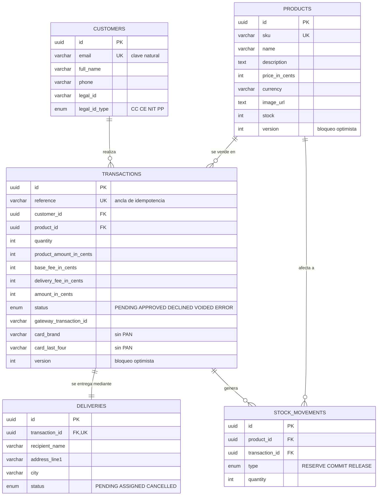

# Tienda — checkout de pago con tarjeta de crédito

Aplicación de onboarding de pago: el cliente ve un producto con su stock, paga con
tarjeta de crédito a través de una pasarela colombiana en modo sandbox, recibe el
resultado de la transacción y vuelve a la página del producto con el stock ya
actualizado.

Monorepo con una SPA en React y una API en Nest.js construida con **arquitectura
hexagonal**, **Unit of Work**, **Railway Oriented Programming** y **transacciones
idempotentes**.

> La pasarela se nombra en el código y en la documentación como `PSP` /
> `payment-gateway`, nunca por su marca comercial.

---

## Stack

| Capa                   | Tecnología                                                      |
| ---------------------- | --------------------------------------------------------------- |
| Backend                | Nest.js 11 · TypeScript · MikroORM · PostgreSQL 16              |
| Programación funcional | `neverthrow` (`Result` / `ResultAsync`)                         |
| Frontend               | React 19 · Vite · Redux Toolkit + `redux-persist` · Tailwind v4 |
| Contrato compartido    | Zod, en `packages/shared`                                       |
| Tests unitarios        | Jest (backend, frontend y contrato)                             |
| E2E e integración      | Playwright                                                      |
| Infraestructura        | AWS vía `boto3` (Python) · EC2 + RDS · S3 + CloudFront ×2       |

## Estructura

```
apps/
  api/        API Nest.js
    src/
      modules/<slice>/
        domain/           entidades POJO, value objects, puertos, errores
        application/      casos de uso (ROP)
        infrastructure/   controllers HTTP, repositorios, adapters del PSP
      shared/             kernel compartido (Unit of Work, Clock, Result)
      config/             único punto que lee variables de entorno
  web/        SPA React
packages/
  shared/     schemas Zod, rutas y test-ids compartidos entre front, back y e2e
e2e/          Playwright: pruebas funcionales, de integración y evidencia visual
docs/
  adr/        decisiones de arquitectura
  evidence/   capturas por rama, adjuntas a cada pull request
scripts/      utilidades de desarrollo (generación de evidencia)
```

La **regla de dependencia** (`domain` → nada; `application` → `domain`;
`infrastructure` → todo) no es una convención documentada: la aplica
`eslint-plugin-boundaries` y romperla rompe el build.

## Modelo de datos



Tres restricciones sostienen la corrección del sistema y merecen leerse juntas:

| Restricción                                        | Qué impide                                                   |
| -------------------------------------------------- | ------------------------------------------------------------ |
| `transactions.reference` **único**                 | Un reintento hacia la pasarela no genera un segundo cobro    |
| `stock_movements (transaction_id, type)` **único** | Un webhook reenviado no vuelve a mover el inventario         |
| `products.version` (bloqueo optimista)             | Dos compradores simultáneos no venden la misma última unidad |

El inventario es un **ledger de solo anexado**: `RESERVE` al abrir la transacción,
`COMMIT` si el pago se aprueba y `RELEASE` si falla. Nunca se actualiza ni se borra
un movimiento, así que el histórico explica cómo se llegó al stock actual.

## Puesta en marcha

Requisitos: Node ≥ 20, pnpm 11, Docker.

```bash
cp .env.example .env
pnpm install
pnpm db:up
pnpm --filter @payments/api migration:up
pnpm --filter @payments/api seed
pnpm build
```

> `pnpm db:up` usa `docker compose`. Si tu Docker no trae el plugin de Compose
> (habitual con Colima), instálalo con `brew install docker-compose` y enlázalo:
> `mkdir -p ~/.docker/cli-plugins && ln -sf $(brew --prefix)/bin/docker-compose ~/.docker/cli-plugins/docker-compose`.

Desarrollo:

```bash
pnpm --filter @payments/api dev     # API en http://localhost:3000/api/v1
pnpm --filter @payments/web dev     # SPA en http://localhost:5173
```

Documentación interactiva de la API (Swagger UI, con el servidor local corriendo):
`http://localhost:3000/api/v1/docs`.

Sin necesidad de levantar nada: el spec OpenAPI está exportado en
[`docs/api/openapi.json`](docs/api/openapi.json), y la colección de Postman lista
para importar en [`docs/api/postman-collection.json`](docs/api/postman-collection.json)
(generada directamente desde ese spec — importarla en Postman reconstruye cada
endpoint con su esquema de request/response).

## Configuración

Todas las variables se declaran en `.env.example` y se validan **al arranque** con
Zod. Si falta una o está mal formada, el proceso falla en el bootstrap nombrando la
variable, en lugar de reventar a mitad de una transacción.

Ningún otro módulo lee `process.env` ni `import.meta.env`: una regla de ESLint lo
rechaza fuera de `src/config`, que es lo que impide que reaparezcan valores quemados.

## Despliegue en AWS

**Frontend**: https://d1dtarobacz3m4.cloudfront.net
**API**: https://d2zndyleuktobb.cloudfront.net/api/v1

```
                    ┌──────────────────────┐
   Usuario ────────▶│ CloudFront (frontend)│──▶ S3 (build de apps/web)
                    └──────────────────────┘

                    ┌──────────────────────┐      ┌───────────────┐
   Usuario ────────▶│  CloudFront (API)    │─────▶│ EC2 t3.micro  │─────▶ Pasarela
                    └──────────────────────┘      │ (apps/api,pm2)│       (sandbox,
                                                    └───────┬───────┘        internet)
                                                            │ :5432, SG restringido
                                                            ▼
                                                    ┌───────────────┐
                                                    │  RDS Postgres │
                                                    │  db.t3.micro  │
                                                    └───────────────┘
```

| Servicio                       | Rol                                                                                | Por qué así                                                                                     |
| ------------------------------ | ---------------------------------------------------------------------------------- | ----------------------------------------------------------------------------------------------- |
| **EC2** `t3.micro`             | Corre la API compilada bajo `pm2`, con IP elástica                                 | Free tier 12 meses; sale a internet directo (sin NAT Gateway) para hablar con la pasarela real  |
| **RDS Postgres** `db.t3.micro` | Base de datos, en un security group que solo acepta `5432` desde el EC2 de la API  | Free tier 12 meses; nunca expuesta a internet                                                   |
| **CloudFront (API)**           | Termina TLS frente al EC2, sobre HTTP en el puerto de la API                       | HTTPS gratis sin pagar un Load Balancer                                                         |
| **S3 + CloudFront (frontend)** | Hosting estático del build de `apps/web`, bucket privado con Origin Access Control | S3 y CloudFront tienen free tier permanente (Always Free), no solo los 12 meses de cuenta nueva |

Sin VPC nueva ni NAT Gateway: se reutiliza la VPC _default_ de la cuenta (ya
tiene subnets públicas con salida a internet), y el security group de la API
solo acepta el puerto de la aplicación desde el rango gestionado por AWS para
el borde de CloudFront — nunca desde internet en general.

Provisionado con scripts de `boto3` puro en [`infra/`](infra/) (sin
CDK/CloudFormation), pensados para no salir del free tier de una cuenta nueva.
El orden de ejecución y el detalle de cada recurso están documentados en
[`infra/README.md`](infra/README.md).

### Decisiones que salieron de desplegar contra recursos reales

- **RDS exige TLS y el driver no lo activa solo** (ver
  [`mikro-orm.config.ts`](apps/api/src/persistence/mikro-orm.config.ts)):
  `?sslmode=` en la URL de conexión se descarta silenciosamente al pasar por
  `knex`; hace falta pasarlo explícito vía `driverOptions` cuando
  `NODE_ENV=production`.
- **El webhook de la pasarela no puede apuntar a un despliegue individual**
  en una cuenta de sandbox compartida entre candidatos — ver
  [ADR 0003](docs/adr/0003-liquidacion-por-status-poll.md): el sistema ahora
  le pregunta directamente a la pasarela el estado de una transacción que
  sigue `PENDING`, en vez de depender solo del webhook.

## Tests

```bash
pnpm test          # unitarios (Jest) en todos los workspaces
pnpm test:cov      # con el umbral de cobertura del 80%
pnpm e2e           # Playwright sobre los artefactos compilados
```

El umbral vive en cada `jest.config.js`, de modo que `pnpm test:cov` falla en local
por la misma razón por la que falla CI. En los pull requests, además, un bot publica
la tabla de cobertura por archivo.

### Cobertura actual

| Workspace          | Statements | Branches | Functions | Lines  |
| ------------------ | ---------- | -------- | --------- | ------ |
| `@payments/shared` | 85.96%     | 100%     | 100%      | 97.14% |
| `@payments/api`    | 98.25%     | 95.60%   | 98.53%    | 98.74% |
| `@payments/web`    | 98.05%     | 89.21%   | 100%      | 99.65% |

Playwright **no** cuenta para este porcentaje: son dos suites con propósitos
distintos. Jest cubre unidades y contratos; Playwright prueba el sistema completo y
genera la evidencia visual de cada PR.

## Flujo de trabajo

`main` está protegida: sin push directo, PR obligatorio y los checks `api`, `web` y
`e2e` en verde como condición de merge, con squash e historial lineal.

Ritual antes de abrir un PR:

```bash
pnpm test:cov
pnpm evidence                       # capturas en docs/evidence/<rama>
git add docs/evidence/<rama>
git commit -m "docs(e2e): evidencia de <rama>"
git push -u origin HEAD
pnpm pr:body                        # enlaza por SHA y verifica cada imagen
gh pr create --body-file .github/pr-body.md
```

`pnpm evidence` compila los artefactos y corre Playwright capturando pantallas en
375×667 y 1280×800. `pnpm pr:body` se ejecuta **después del push** y arma la
descripción del PR.

Son dos pasos y no uno por una razón concreta: las imágenes se enlazan por **SHA de
commit**, no por nombre de rama. Una URL de rama deja de resolver en cuanto la rama
se borra —justo lo que hace un squash merge con `--delete-branch`—, y todas las
imágenes del PR ya mergeado se rompen en silencio. GitHub conserva
`refs/pull/N/head` para siempre, así que un SHA nunca caduca; pero ese SHA no existe
hasta después del push. Además `pnpm pr:body` hace un `HEAD` contra cada URL y
aborta si alguna no devuelve `200`, de modo que una descripción con imágenes muertas
no puede llegar a un PR.

Si el PR ya está abierto, `pnpm pr:body --apply` actualiza su descripción en sitio.

## Decisiones de arquitectura

- [ADR 0001 — MikroORM como ORM, por el Unit of Work](docs/adr/0001-mikroorm-para-unit-of-work.md)
- [ADR 0002 — Idempotencia en tres capas](docs/adr/0002-idempotencia-en-tres-capas.md)
- [ADR 0003 — Liquidación por status-poll cuando el webhook no llega](docs/adr/0003-liquidacion-por-status-poll.md)

## Estado

| Etapa | Alcance                                                         | Estado     |
| ----- | --------------------------------------------------------------- | ---------- |
| 1     | Andamiaje, CI, gate de cobertura, harness de evidencia          | Completado |
| 2     | Núcleo de dominio, Unit of Work, ROP, MikroORM, contrato Zod    | Completado |
| 3     | Catálogo de producto — `GET /products` + pantalla 1             | Completado |
| 4     | Formulario de tarjeta y entrega — `POST /checkout` + pantalla 2 | Completado |
| 5     | Resumen y cobro — `POST /checkout/:id/pay` + pantalla 3         | Completado |
| 6     | Resultado y stock — webhook + pantallas 4 y 5                   | Completado |
| 7     | Cierre de cobertura                                             | Completado |
| 8     | Infraestructura AWS y despliegue                                | Completado |

### Cambios recientes

- **Indicador de modo sandbox/fake**: la pantalla de resultado muestra si el
  cobro se procesó contra el sandbox real de la pasarela o el driver `fake`
  (`gatewayMode` en el DTO), para que nunca sea ambiguo qué se está probando.
- **Rate limiting**: `@nestjs/throttler` conectado sobre toda la API — la
  configuración ya existía, pero nunca estaba cableada a nada.
- **Resumen de pago en la pantalla de resultado**: monto total y tarjeta
  (marca + últimos 4 dígitos) visibles junto al estado final del pago, no
  solo la referencia de la transacción.
- **Formulario de tarjeta y entrega**: "Tipo de documento" y "País" pasaron a
  su propia fila (sus etiquetas largas desalineaban el input contra el campo
  vecino en una columna compartida angosta); documento de identidad y código
  postal ahora solo aceptan dígitos, igual que ya exigía el teléfono.
- **Liquidación por status-poll**: ver
  [ADR 0003](docs/adr/0003-liquidacion-por-status-poll.md).
