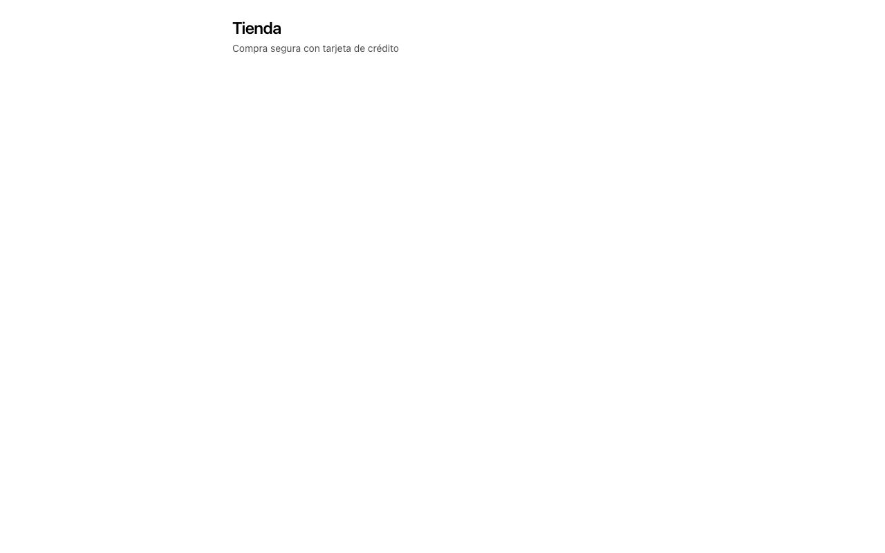

# Evidencia — `chore/scaffold`

Capturas generadas por `pnpm evidence` el 2026-08-22.

| # | Caso | Viewport | Archivo |
| --- | --- | --- | --- |
| 1 | Shell de la aplicacion | 375x667 | `01-mobile-shell-de-la-aplicacion.png` |
| 2 | Shell de la aplicacion | 1280x800 | `01-desktop-shell-de-la-aplicacion.png` |

## 1. Shell de la aplicacion

## 2. Shell de la aplicacion

