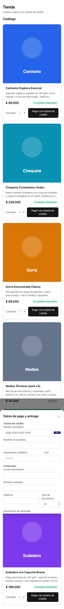
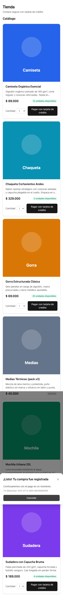
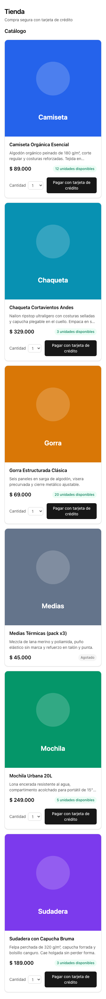
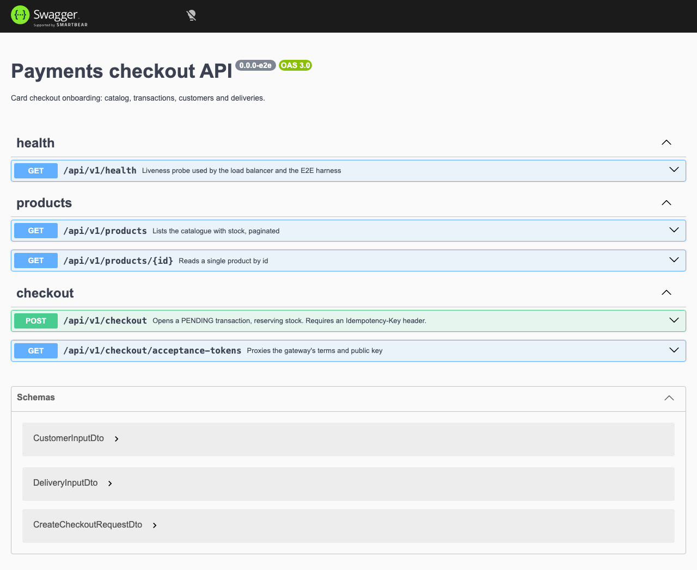
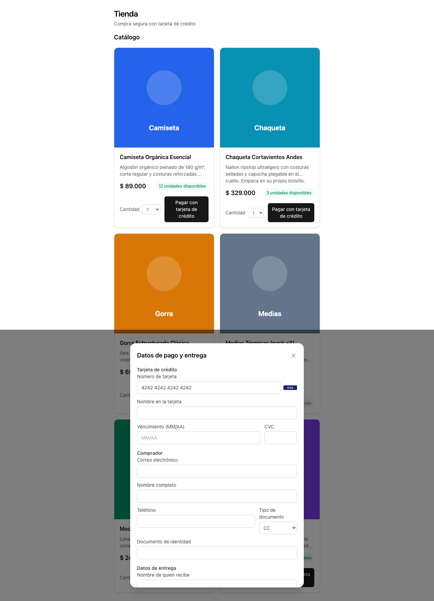
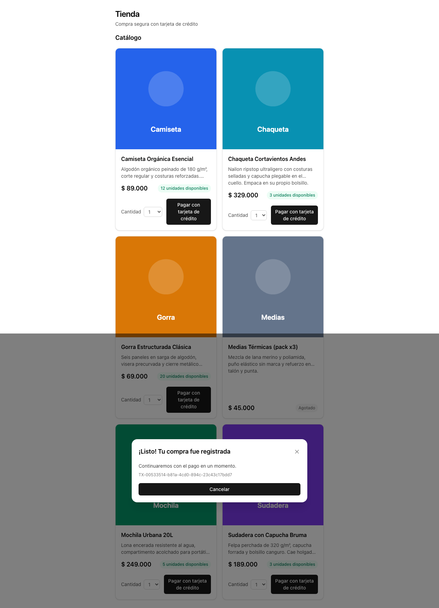
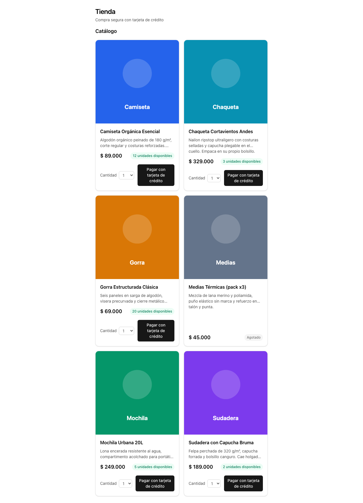

# Evidencia — `feat/checkout-form`

Capturas generadas por `pnpm evidence` el 2026-08-23.

| # | Caso | Viewport | Archivo |
| --- | --- | --- | --- |
| 1 | Modal de tarjeta con marca detectada | 375x667 | `01-mobile-modal-de-tarjeta-con-marca-detectada.png` |
| 2 | Confirmacion tras abrir el checkout | 375x667 | `02-mobile-confirmacion-tras-abrir-el-checkout.png` |
| 3 | Catalogo de productos | 375x667 | `03-mobile-catalogo-de-productos.png` |
| 4 | Shell de la aplicacion | 375x667 | `04-mobile-shell-de-la-aplicacion.png` |
| 5 | Swagger UI con la API en linea | 1280x800 | `01-desktop-swagger-ui-con-la-api-en-linea.png` |
| 6 | Modal de tarjeta con marca detectada | 1280x800 | `02-desktop-modal-de-tarjeta-con-marca-detectada.png` |
| 7 | Confirmacion tras abrir el checkout | 1280x800 | `03-desktop-confirmacion-tras-abrir-el-checkout.png` |
| 8 | Catalogo de productos | 1280x800 | `04-desktop-catalogo-de-productos.png` |
| 9 | Shell de la aplicacion | 1280x800 | `05-desktop-shell-de-la-aplicacion.png` |

## 1. Modal de tarjeta con marca detectada

## 2. Confirmacion tras abrir el checkout

## 3. Catalogo de productos

## 4. Shell de la aplicacion

## 5. Swagger UI con la API en linea

## 6. Modal de tarjeta con marca detectada

## 7. Confirmacion tras abrir el checkout

## 8. Catalogo de productos

## 9. Shell de la aplicacion

