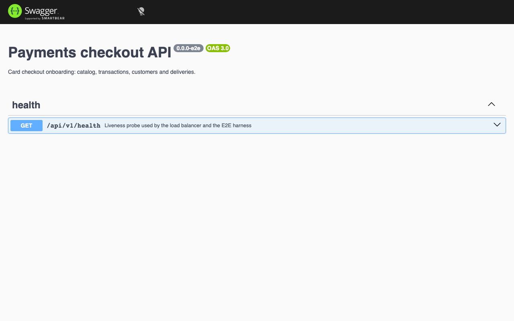

# Evidencia — `feat/domain-core`

Capturas generadas por `pnpm evidence` el 2026-08-22.

| # | Caso | Viewport | Archivo |
| --- | --- | --- | --- |
| 1 | Shell de la aplicacion | 375x667 | `01-mobile-shell-de-la-aplicacion.png` |
| 2 | Swagger UI con la API en linea | 1280x800 | `01-desktop-swagger-ui-con-la-api-en-linea.png` |
| 3 | Shell de la aplicacion | 1280x800 | `02-desktop-shell-de-la-aplicacion.png` |

## 1. Shell de la aplicacion

## 2. Swagger UI con la API en linea

## 3. Shell de la aplicacion

