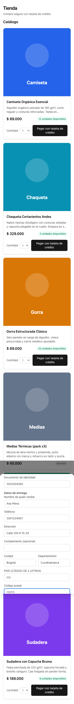
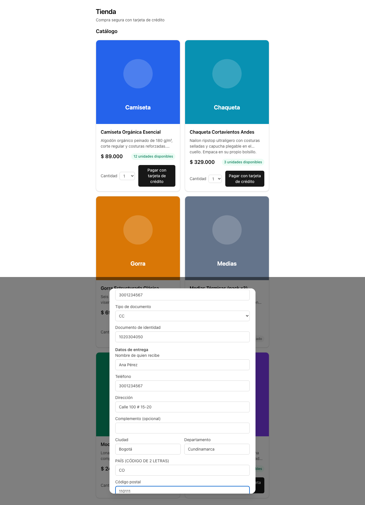

# Evidencia — `fix/checkout-form-ux-and-status-poll`

Capturas generadas por `pnpm evidence` el 2026-08-24.

| # | Caso | Viewport | Archivo |
| --- | --- | --- | --- |
| 1 | Tipo de documento y país en filas propias | 375x667 | `01-mobile-tipo-de-documento-y-pais-en-filas-propias.png` |
| 2 | Tipo de documento y país en filas propias | 1280x800 | `01-desktop-tipo-de-documento-y-pais-en-filas-propias.png` |

## 1. Tipo de documento y país en filas propias

## 2. Tipo de documento y país en filas propias

