# Evidencia — `fix/modal-focus-steals-input`

Capturas generadas por `pnpm evidence` el 2026-08-24.

| # | Caso | Viewport | Archivo |
| --- | --- | --- | --- |
| 1 | Modal de tarjeta con marca detectada | 375x667 | `01-mobile-modal-de-tarjeta-con-marca-detectada.png` |
| 2 | Resumen tras abrir el checkout | 375x667 | `02-mobile-resumen-tras-abrir-el-checkout.png` |
| 3 | Resumen con desglose de precio | 375x667 | `03-mobile-resumen-con-desglose-de-precio.png` |
| 4 | Pago aprobado | 375x667 | `04-mobile-pago-aprobado.png` |
| 5 | Pago rechazado | 375x667 | `05-mobile-pago-rechazado.png` |
| 6 | Error del gateway | 375x667 | `06-mobile-error-del-gateway.png` |
| 7 | Catalogo de productos | 375x667 | `07-mobile-catalogo-de-productos.png` |
| 8 | Shell de la aplicacion | 375x667 | `08-mobile-shell-de-la-aplicacion.png` |
| 9 | Stock actualizado tras el pago | 375x667 | `09-mobile-stock-actualizado-tras-el-pago.png` |
| 10 | Swagger UI con la API en linea | 1280x800 | `01-desktop-swagger-ui-con-la-api-en-linea.png` |
| 11 | Modal de tarjeta con marca detectada | 1280x800 | `02-desktop-modal-de-tarjeta-con-marca-detectada.png` |
| 12 | Resumen tras abrir el checkout | 1280x800 | `03-desktop-resumen-tras-abrir-el-checkout.png` |
| 13 | Resumen con desglose de precio | 1280x800 | `04-desktop-resumen-con-desglose-de-precio.png` |
| 14 | Pago aprobado | 1280x800 | `05-desktop-pago-aprobado.png` |
| 15 | Pago rechazado | 1280x800 | `06-desktop-pago-rechazado.png` |
| 16 | Error del gateway | 1280x800 | `07-desktop-error-del-gateway.png` |
| 17 | Catalogo de productos | 1280x800 | `08-desktop-catalogo-de-productos.png` |
| 18 | Shell de la aplicacion | 1280x800 | `09-desktop-shell-de-la-aplicacion.png` |
| 19 | Stock actualizado tras el pago | 1280x800 | `10-desktop-stock-actualizado-tras-el-pago.png` |

## 1. Modal de tarjeta con marca detectada

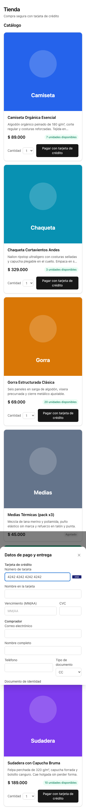

## 2. Resumen tras abrir el checkout

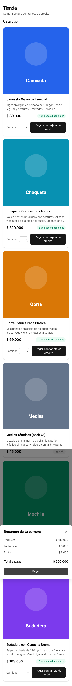

## 3. Resumen con desglose de precio

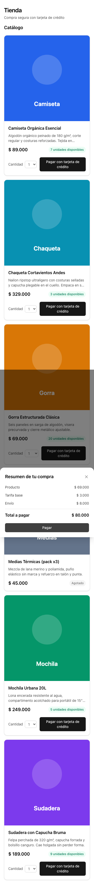

## 4. Pago aprobado

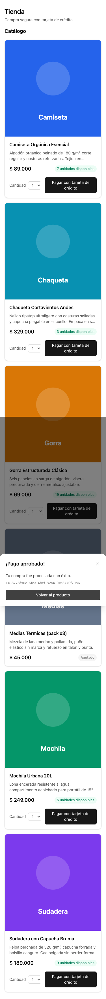

## 5. Pago rechazado

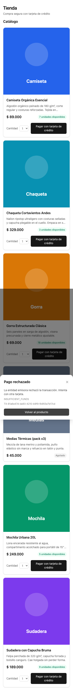

## 6. Error del gateway

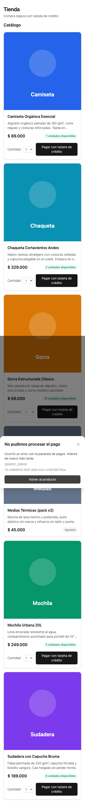

## 7. Catalogo de productos

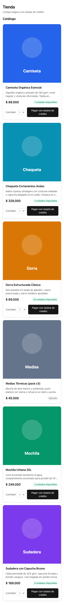

## 8. Shell de la aplicacion

## 9. Stock actualizado tras el pago

## 10. Swagger UI con la API en linea

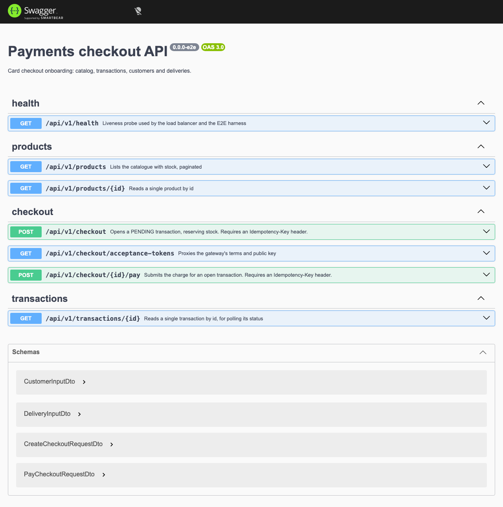

## 11. Modal de tarjeta con marca detectada

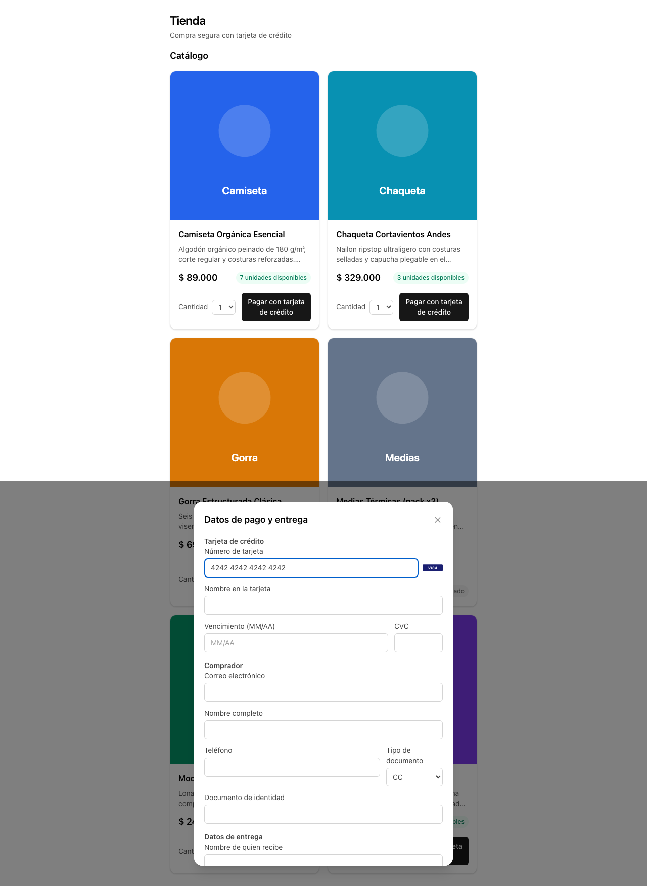

## 12. Resumen tras abrir el checkout

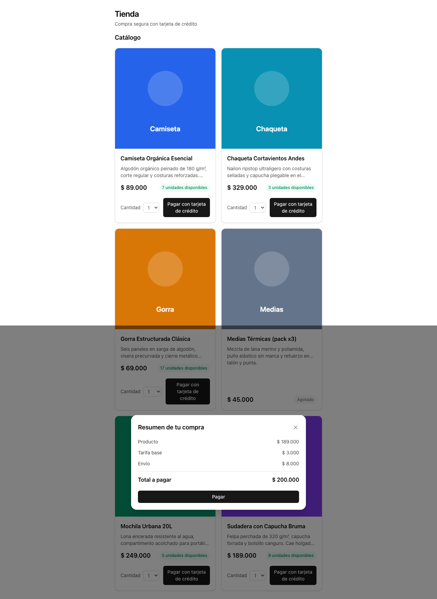

## 13. Resumen con desglose de precio

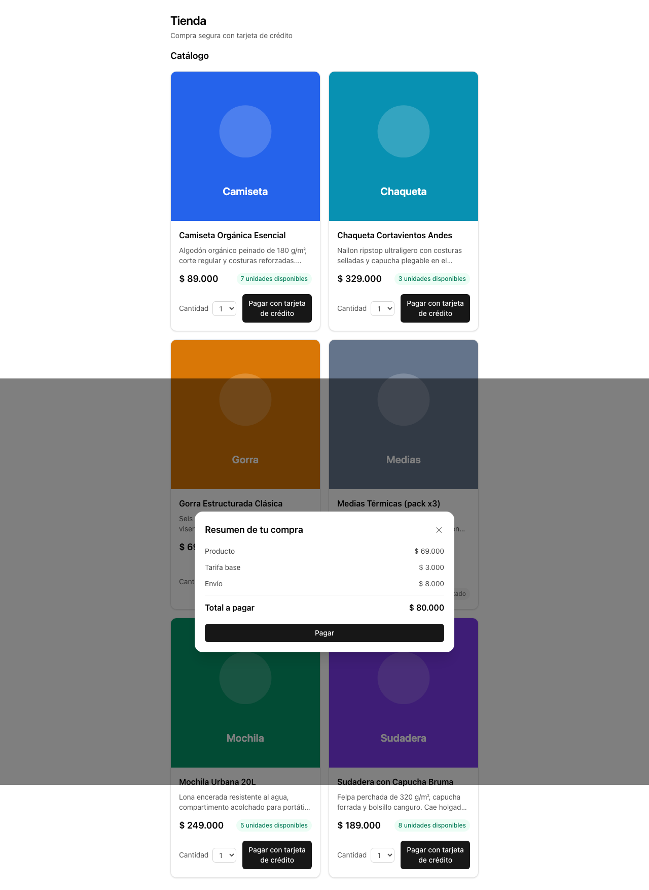

## 14. Pago aprobado

## 15. Pago rechazado

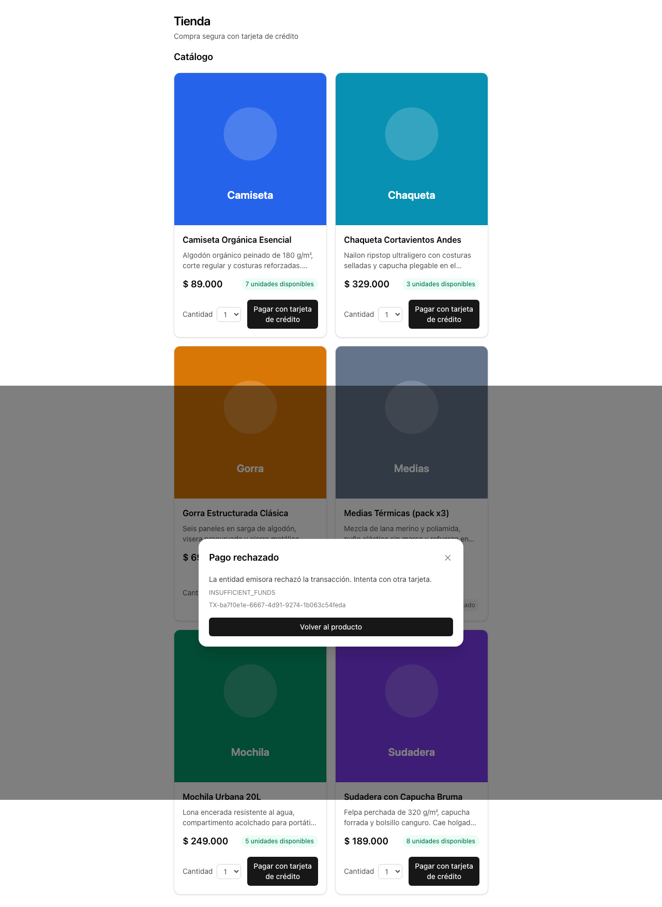

## 16. Error del gateway

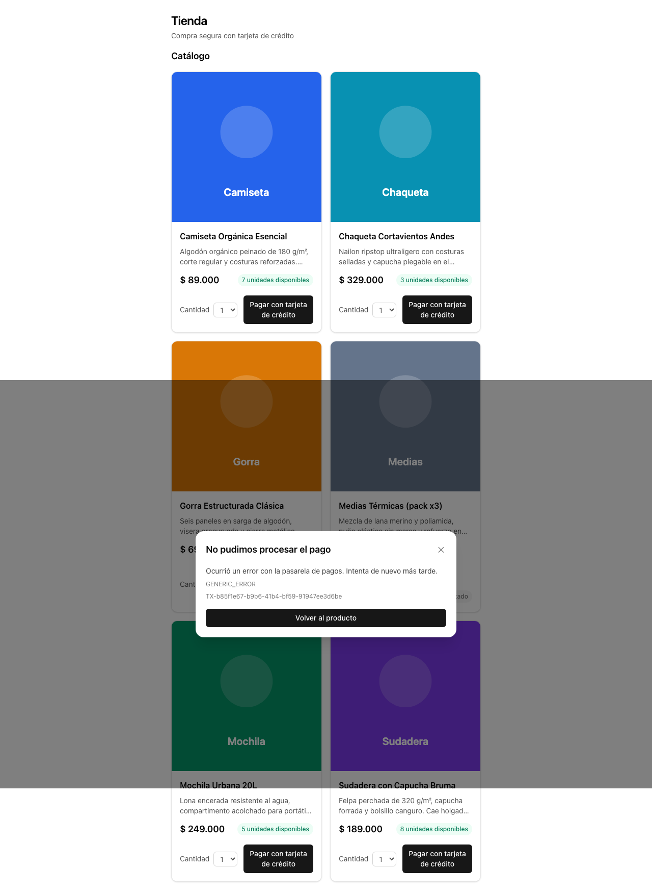

## 17. Catalogo de productos

## 18. Shell de la aplicacion

## 19. Stock actualizado tras el pago

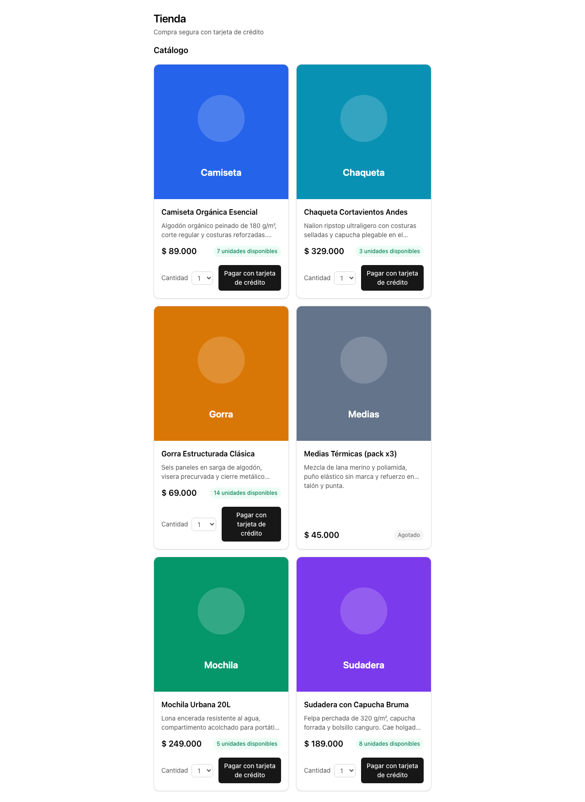
